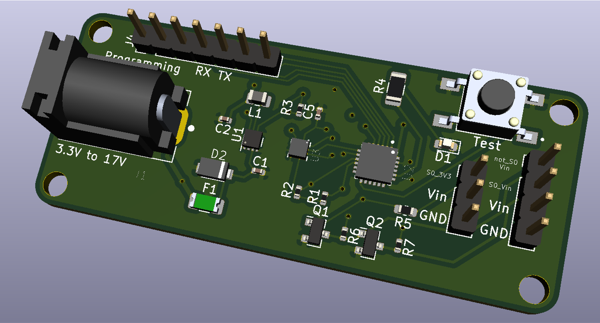

# TackleSensorPCB
 Robotic Football Tackle Sensor Hardware Design created by Jon Bayert

 This is currenly under development. A very rough price will be $15-20 but depends on the number ordered. It will be sent out for assembly but will still need to be flashed.

 The current prototype design in the kicad repo looks like:

 

Also take a look at:

 * [The Typical Use](./docs/TypicalUse.md)
 * [The Schematic](./docs/Schematics/schematic.pdf)
