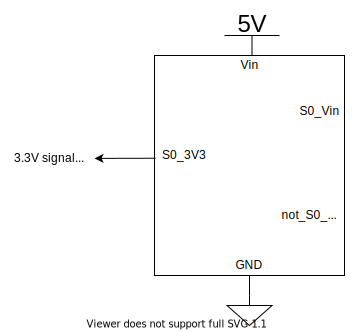
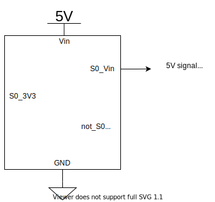
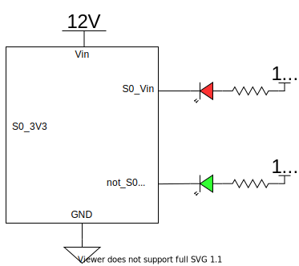

# Tackle Sensor Typical Use

## Pins

| Tables        | Are           |
|:-------------:|:-------------:|
| Vin      | Input Voltage (3.3V to 17V) |
| GND      | The ground pin      |
| S0_3V3 | Tackle Signal at 3.3V (low is tackled)   |
| S0_Vin | Tackle Signal at Vin Voltage (low is tackled)   |
| not_S0_Vin | Inverted Tackle Signal at Vin Voltage (high is tackled)   |

## 3.3V Signal to Microcontroller

The S0_3V3 pin will always output 3.3V regardless of Vin voltage. This can be useful to send a signal to a microcontroller such as ESP32 or a raspberry pi. 

## 5V Signal to Microcontroller

The S0_Vin pin will always output the same voltage as Vin. This can be useful to send a signal to a microcontroller such as Arduinos with 5V pins.

## Drive LEDs with the Tackle Sensor

The S0_Vin pin can be connected as to LEDs. In this example the RED Led will be on when tackled and the green LED will be on when it is not tackled.  

